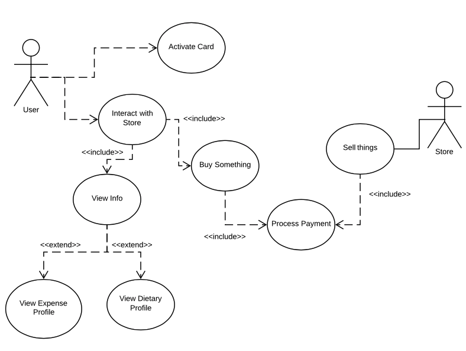

#####Riley Bergin Mason Bruce COEN160
##Deliverable 1

###<u>Use Case Diagram</u>

###<u>CRC Cards</u>
<!--CCU-->
<table style='width:70%; border: 1px solid black;'>
	 <thead>
        <tr>
            <th colspan="2" style="text-align: left;">
            		CampusCardUser
            </th>
        </tr>
        
    </thead>
	<tr style='width:100%;'>
		<th style='width:50%;'>
			Responsibility
		</td>
		<th style='width:50%;'>
			Colaborator
		</td>
	</tr>
	<tr style='width:100%;'>
		<td style='width:50%;'>
			
		</td>
		<td style='width:50%;'>
		
		</td>
	</tr>
</table>
<!--Store-->
<table style='width:70%; border: 1px solid black;'>
	 <thead>
        <tr>
            <th colspan="2" style="text-align: left;">
            		Store
            </th>
        </tr>
        
    </thead>
	<tr style='width:100%;'>
		<th style='width:50%;'>
			Responsibility
		</td>
		<th style='width:50%;'>
			Colaborator
		</td>
	</tr>
	<tr style='width:100%;'>
		<td style='width:50%;'>
			
		</td>
		<td style='width:50%;'>
		
		</td>
	</tr>
</table>

<!--CampusCard-->
<table style='width:70%; border: 1px solid black;'>
	 <thead>
        <tr>
            <th colspan="2" style="text-align: left;">
            		CampusCard
            </th>
        </tr>
        
    </thead>
	<tr style='width:100%;'>
		<th style='width:50%;'>
			Responsibility
		</td>
		<th style='width:50%;'>
			Colaborator
		</td>
	</tr>
	<tr style='width:100%;'>
		<td style='width:50%;'>
			
		</td>
		<td style='width:50%;'>
		
		</td>
	</tr>
</table>

<!--SnackItem-->
<table style='width:70%; border: 1px solid black;'>
	 <thead>
        <tr>
            <th colspan="2" style="text-align: left;">
            		SnackItem
            </th>
        </tr>
        
    </thead>
	<tr style='width:100%;'>
		<th style='width:50%;'>
			Responsibility
		</td>
		<th style='width:50%;'>
			Colaborator
		</td>
	</tr>
	<tr style='width:100%;'>
		<td style='width:50%;'>
			
		</td>
		<td style='width:50%;'>
		
		</td>
	</tr>
</table>

<!--ExpenseProfile-->
<table style='width:70%; border: 1px solid black;'>
	 <thead>
        <tr>
            <th colspan="2" style="text-align: left;">
            		ExpenseProfile
            </th>
        </tr>
        
    </thead>
	<tr style='width:100%;'>
		<th style='width:50%;'>
			Responsibility
		</td>
		<th style='width:50%;'>
			Colaborator
		</td>
	</tr>
	<tr style='width:100%;'>
		<td style='width:50%;'>
			
		</td>
		<td style='width:50%;'>
		
		</td>
	</tr>
</table>