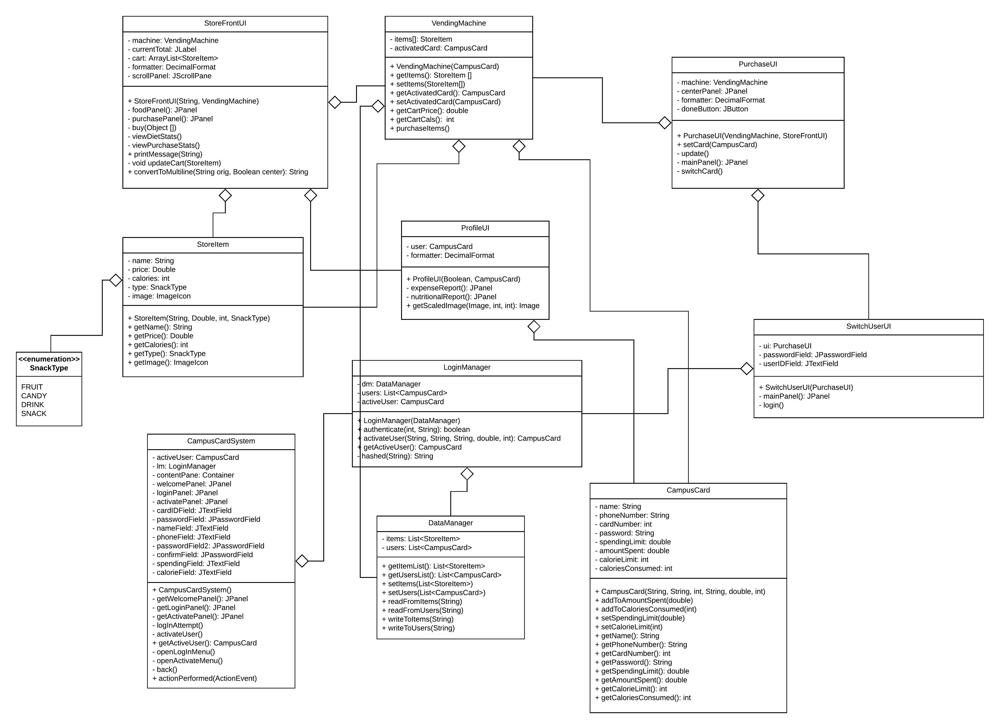

## Final Project - COEN 160 Riley Bergin, Mason Bruce

#### Class Diagram:

#### Interaction Diagrams:

<u>Logging In</u> 

<u>Activating a new Campus Card</u> 

#### Interface:

<u>Launch</u> 

 <u>Login</u> 

 <u>Activate new card</u> 

 <u>Store</u> 

 <u>Add to cart</u> 

 <u>Buy</u> 

 <u>Switch card</u> 

 <u>Purchase complete</u> 

#### Classes:

<table style="width: 75%;">
	<tr>
		<td>
			<b>
				Class
			</b>
		</td>
		<td>
			<b>
				Author
			</b>
		</td>
	</tr>
	<tr>
		<td>
			CampusCard 
		</td>
		<td>
			Riley Bergin
		</td>
	</tr>
	<tr>
		<td>
			CampusCardSystem
		</td>
		<td>
			Riley Bergin
		</td>
	</tr>
	<tr>
		<td>
			DataManager
		</td>
		<td>
			Riley Bergin
		</td>
	</tr>
	<tr>
		<td>
			LoginManager
		</td>
		<td>
			Riley Bergin
		</td>
	</tr>
	<tr>
		<td>
			StoreFrontUI
		</td>
		<td>
			Mason Bruce
		</td>
	</tr>
	<tr>
		<td>
			VendingMachine
		</td>
		<td>
			Mason Bruce
		</td>
	</tr>
	<tr>
		<td>
			StoreItem 
		</td>
		<td>
			Mason Bruce
		</td>
	</tr>
	<tr>
		<td>
			ProfileUI
		</td>
		<td>
			Mason Bruce
		</td>
	</tr>
	<tr>
		<td>
			PurchaseUI
		</td>
		<td>
			Mason Bruce
		</td>
	</tr>
	<tr>
		<td>
			SwitchUserUI 
		</td>
		<td>
			Mason Bruce
		</td>
	</tr>
</table>
